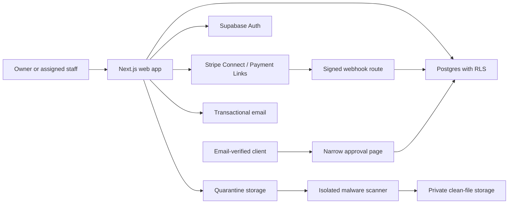

# MarginGuard MVP Implementation Plan

**Status:** Ready for implementation review  
**Date:** 2026-07-29  
**Source design:** `C:\Users\efe\Downloads\stitch_marginguard_profit_os.zip`

## 1. Product outcome

MarginGuard's first release has one job:

> Turn an out-of-scope client request into an approved and paid Change Order before work begins.

The release is an invite-only, desktop-first web application that handles real business data. It is not a prototype. The first pilot is for the founder and the founder's father, but the data model and security boundaries are multi-tenant from the start.

### Core happy path

1. An invited owner creates a business and completes MFA enrollment.
2. The owner creates a client and project.
3. The owner records a structured scope, revision limit, price, currency, and extra-work pricing rule.
4. The owner assigns selected staff to the project.
5. An assigned member records a Change Request. Supporting client evidence is optional.
6. The system calculates an extra-work price from hourly or fixed pricing; a human confirms it.
7. An authorized user creates and sends an immutable Change Order version.
8. The client opens an expiring link, verifies their email with an OTP, and approves or rejects that exact version.
9. If Stripe is connected and a deposit is required, MarginGuard creates a one-use Stripe-hosted Payment Link.
10. Only a verified Stripe webhook, or an audited manual external-payment confirmation, authorizes work.
11. The remaining balance is requested manually and tracked separately.

## 2. Scope

### Included in release 1

- Invite-only owner onboarding
- Email/password authentication
- Mandatory owner TOTP MFA
- Optional staff MFA, mandatory before financial-send permission is enabled
- One owner plus four staff per business
- Email staff invitations
- Project-level staff assignments
- Owner-granted `send_financial_documents` permission
- Client directory with contacts and internal notes
- Projects with structured scope, exclusions, revision limit, timeline, price, and pricing rule
- Private PDF, PNG, JPEG, WebP, and safe `.docx` uploads
- Manual WhatsApp/email paste or `.txt` import
- Manual Change Requests with optional evidence
- Hourly and fixed-price extra-work calculations
- Change Order drafts, immutable sent versions, deposits, and remaining balances
- Email-verified client approval/rejection links
- Stripe Connect for owner-controlled Standard account connection
- Stripe-hosted, one-use Payment Links
- Verified and idempotent Stripe webhook processing
- Audited manual external-payment confirmation
- Revision counting, warnings, and controlled overrides
- Project audit history for the owner and assigned staff
- Business-wide security audit history for the owner
- Transactional notifications with the agreed data boundary
- Project list and action-focused dashboard
- Thirty-day soft-deletion window
- Ownership transfer, recovery codes, active-session controls, and time-limited support access

### Explicitly excluded from release 1

- All live AI features and all AI placeholders
- Automatic scope extraction
- Automatic request or scope-creep detection
- AI writing, pricing, risk scores, and quote intelligence
- Direct Gmail, Outlook, or WhatsApp connections
- Bank and accounting-platform connections
- Card collection or storage inside MarginGuard
- Refunds, payouts, transfers, or Stripe bank-detail management
- Native mobile apps, PWA installation, and mobile-specific layouts
- Full client accounts or a full client portal
- Electronic-signature claims, drawn signatures, notarization, or identity-document checks
- Country-specific legal, tax, invoice, or accounting compliance claims
- Excel and legacy/macro-enabled Word uploads
- Broad profitability analytics, time tracking, tasks, expenses, invoices, and reports beyond what the core Change Order workflow needs

### Release 1.1, after the core workflow is stable

- Time tracking
- Expense and receipt tracking
- Project budget and quoted-versus-actual profit
- Formula-based money-leak dashboard
- Invoice builder and overdue status
- Template-based payment follow-ups
- Exportable accounting reports

## 3. Architecture decision

### Options considered

| Option | Strengths | Problems | Decision |
|---|---|---|---|
| Next.js + Supabase + Stripe | Fastest secure path to relational data, TOTP MFA, RLS, private storage, SSR, and hosted payments | Requires careful RLS, custom recovery codes, custom SMTP, and a separate malware scanner | **Chosen** |
| Django/Laravel monolith + managed Postgres | Maximum backend control and mature server patterns | More authentication, storage, deployment, and operations work for a small pilot | Not chosen |
| Firebase + serverless functions | Fast authentication and simple deployment | Relational authorization, immutable financial versions, and reporting are a poor fit | Not chosen |

### Chosen stack

- **Application:** Next.js App Router, TypeScript, Node.js runtime
- **UI:** React Server Components for reads; client components only for interactive forms and previews
- **Styling:** Tailwind CSS with reusable design tokens derived from Stitch
- **Database/Auth/Storage:** Supabase Postgres, Auth, and private Storage
- **Payments:** Stripe Connect Standard accounts and Stripe-hosted Payment Links
- **Email:** Custom production SMTP provider; separate auth and transactional sending identities
- **File safety:** A small isolated container worker running ClamAV and bounded document extraction
- **Deployment:** Vercel for the web application; managed container host for the scanner
- **Testing:** Vitest, React Testing Library, Playwright, SQL/RLS tests, and Stripe CLI webhook tests
- **Observability:** Structured redacted logs, error tracking, uptime checks, and security alerts

Use currently supported stable releases when implementation begins. Pin exact dependency versions and commit the lockfile.

### Request/data flow



The browser never receives the Supabase secret/service key, Stripe secret key, SMTP password, recovery-code pepper, or scanner credential.

## 4. Stitch design adaptation

Preserve the supplied editorial system:

- Warm off-white workspace
- Charcoal sidebar
- International orange for primary action and high-priority money states
- Playfair Display headings
- Plus Jakarta Sans interface text with tabular numeric figures
- Hairline borders, no decorative shadows, 8px standard radius

Adapt the supplied screens as follows:

| Stitch screen | Release 1 treatment |
|---|---|
| Dashboard | Replace AI risk and money-leak predictions with deterministic action queues: unsent drafts, approvals waiting, deposits waiting, balances due, and revision-limit warnings |
| Projects list | Keep; calculate only known quoted value, approved extras, confirmed payments, and manual status |
| Project workspace | Keep Scope, Change Requests, Change Orders, Payments, Files, and Audit tabs; remove AI warnings, tasks, time/costs, invoices, reports, and risk score |
| Scope analysis | Rename to **Project Scope**; show owner-entered deliverables, exclusions, revision limit, timeline, pricing rule, and supporting documents; remove confidence scores and analysis column |
| Change Order creator | Keep the split editor/preview; add deposit percentage, optional evidence warning, version status, and authorization state |
| Client profile | Keep identity, contacts, projects, approvals, and payment history; remove AI risk and “recent intel” |
| Reports | Exclude from release 1; add later with deterministic calculations |

The app is desktop-first. Set a supported minimum content width and provide a clear “desktop browser required” message on narrow screens rather than shipping a broken mobile layout.

## 5. Authorization model

### Business roles

- **Owner**
  - Full business and project access
  - Manages invitations, permissions, Stripe, deletion, exports, support access, and ownership transfer
  - Must have an AAL2/TOTP session for normal application access
- **Staff**
  - Sees only explicitly assigned projects
  - Can create/edit operational drafts for assigned projects
  - Cannot manage the business, Stripe, support access, or other members
  - May send financial documents only when:
    - `send_financial_documents = true`
    - MFA is enrolled
    - the current session is AAL2
    - the user is assigned to that project

No authorization decision may use user-editable auth metadata. Memberships, assignments, and permissions live in application tables and are checked by RLS and server-side command handlers.

### Client access

Clients do not receive accounts. A client session is:

- Limited to one document/version
- Created from a 256-bit random token whose digest, not plaintext, is stored
- Time-limited and revocable
- Upgraded only after email OTP verification
- Held in a secure, HttpOnly, SameSite cookie
- Unable to list or infer other clients, projects, or documents

### Support access

- No hidden impersonation route
- Owner creates a grant for a specific support identity, business, scope, reason, and expiry
- Support identity must use MFA
- Every access appears in the owner-visible audit trail
- Operational access to the Supabase/Vercel/Stripe dashboards is separately restricted to named administrators with MFA

## 6. Security design

### Database isolation

- Every tenant table includes `business_id`.
- Every public/exposed table has RLS enabled.
- RLS combines business membership, active membership status, project assignment, current session validity, and command-specific permission.
- Child records use composite tenant-safe foreign keys where practical so a record cannot reference a parent from another business.
- Index every foreign key and every column used by an RLS policy.
- Views use `security_invoker = true` or remain in an unexposed schema.
- Any necessary `SECURITY DEFINER` function lives in a private schema, fixes `search_path`, checks `auth.uid()` explicitly, and has narrowly granted execution.
- Browser reads and ordinary writes use the signed-in user's RLS-scoped client.
- Service-role access is limited to webhooks, invitation administration, recovery, retention jobs, and scanner callbacks.

### Authentication and sessions

- Disable public signup and anonymous login.
- Require verified email and strong passwords.
- Use PKCE and secure HttpOnly cookies for SSR.
- Owner onboarding cannot complete until TOTP is verified.
- A privileged staff permission cannot be granted until that staff member has TOTP.
- Require fresh AAL2/reauthentication for invitations, permission changes, Stripe management, exports, deletion, recovery-code regeneration, manual payment confirmation, and ownership transfer.
- Configure short-lived access JWTs.
- Configure the paid Supabase session controls for maximum lifetime and inactivity.
- Maintain `app_sessions` keyed by the JWT `session_id` for trusted-device state, last activity, and revocation.
- RLS denies revoked or expired application sessions even while a short-lived JWT is still cryptographically valid.
- Unknown devices lock after 30 minutes of inactivity; trusted personal devices may remain usable for up to 14 days.
- Device management supports current-device logout, all-other-device logout, global logout, and application-level revocation of a selected session.

### Recovery codes

Supabase does not provide recovery codes, so MarginGuard owns this feature.

- Generate high-entropy, single-use codes after MFA enrollment.
- Display once; require download/confirmation.
- Store only keyed digests using a server-only pepper.
- Recovery requires a valid email recovery session plus one unused recovery code.
- Consume the code atomically.
- Delete the lost MFA factor through the server-only admin API.
- Globally revoke sessions.
- Notify all business members.
- Require new TOTP enrollment before application access resumes.
- Never provide a casual support bypass.

### Files

- Allowed: PDF, PNG, JPEG, WebP, `.docx`, and plain-text message exports.
- Rejected: `.doc`, `.docm`, Excel, archives, executables, HTML, password-protected documents, embedded executables, and active content.
- Maximum 20 MB per file and 1 GB per business.
- Upload to a quarantine bucket using a one-time path.
- Validate extension, MIME type, magic bytes, file size, archive expansion ratio, and extracted size.
- Scan with ClamAV in an isolated worker.
- Parse `.docx` in a constrained process with no network access; ignore macros, relationships to remote content, and embedded objects.
- Promote only clean files to a private bucket.
- Use short-lived signed downloads after RLS authorization.
- Never log document bodies, imported messages, or signed file URLs.

### Financial integrity

- Store currency as an ISO 4217 code and amounts as integer minor units.
- Store percentages in basis points.
- Never use floating-point arithmetic for money.
- A sent Change Order creates an immutable version snapshot and SHA-256 content hash.
- Approval points to the exact version and hash.
- Editing a sent version creates a new version and invalidates earlier approval.
- Required deposit is 1–100%.
- Work status can become `authorized` only from:
  - an idempotently processed, signature-verified Stripe event, or
  - a permitted AAL2 user recording a manual external payment with an audit event.
- Remaining balance is requested manually.
- MarginGuard does not perform refunds, payouts, transfers, or card handling.

### Stripe

- Only an AAL2 owner can connect, replace, or disconnect Stripe.
- Use OAuth `state` for CSRF protection and an exact HTTPS redirect URI.
- Store the connected Stripe account ID and minimum connection metadata; do not expose credentials to the browser.
- Create a dedicated, one-use Payment Link for each deposit or final-balance request.
- Put only opaque MarginGuard IDs in Stripe metadata.
- Verify the webhook signature against the raw body.
- Store every Stripe event ID with a unique constraint before applying effects.
- Validate event account, currency, amount, payment-request ID, and expected state.
- Handle duplicates, reordering, asynchronous payment methods, failures, and link expiration.
- Deactivate a Payment Link when its request is cancelled, replaced, manually paid, or completed.

### Audit and notifications

- `audit_events` is append-only from the application.
- Audit: memberships, assignments, permissions, scope versions, Change Order versions, sends, approvals, rejections, payment events, overrides, exports, support access, recovery, ownership transfer, and deletion.
- Do not duplicate sensitive message bodies or document contents into audit rows.
- Owner sees business-wide security events.
- Assigned staff see project audit events.
- Emails may include client/project name, event summary, amount, and deadline.
- Emails never include imported conversations, receipts, contracts, attachments, internal notes, profit figures, or risk scores.
- Use SPF, DKIM, and DMARC; disable tracking on authentication links.

### Retention and deletion

- Project deletion enters recoverable trash for 30 days.
- Business deletion requires password, fresh MFA, typed confirmation, and a delayed deletion job.
- Revoke sessions, client links, support grants, invitations, and Stripe actions when deletion begins.
- Restore is owner-only during the window.
- Purge active data and files after 30 days.
- Backups age out within the documented retention period.
- Keep only minimal security/payment event metadata where required, pseudonymized where possible.

## 7. Data model

Initial tables:

### Identity and tenancy

- `profiles`
- `businesses`
- `business_memberships`
- `business_invitations`
- `project_assignments`
- `app_sessions`
- `recovery_codes`
- `ownership_transfers`
- `support_access_grants`

### Client and project

- `clients`
- `client_contacts`
- `projects`
- `project_scopes`
- `scope_items`
- `project_files`
- `imported_message_batches`
- `imported_messages`
- `revision_events`
- `revision_overrides`

### Change Order workflow

- `change_requests`
- `change_request_evidence`
- `change_order_drafts`
- `change_order_versions`
- `client_access_tokens`
- `client_otp_challenges`
- `change_order_approvals`
- `payment_requests`
- `manual_payment_confirmations`
- `stripe_connections`
- `stripe_events`

### Operations

- `audit_events`
- `notification_outbox`
- `email_deliveries`
- `retention_jobs`
- `file_scan_jobs`

Important constraints:

- One active owner membership per business.
- Maximum five active memberships enforced transactionally.
- Maximum 25 active projects enforced transactionally.
- Unique active project assignment per user/project.
- Only one current scope per project, with full version history.
- Change Order number unique within a business.
- One approval decision per client/verifiable version attempt.
- Stripe event ID globally unique.
- Payment request amount must be positive and no greater than the outstanding balance.
- Cumulative confirmed payments cannot exceed the Change Order total without a separately audited correction.
- Append-only tables reject update/delete from application roles.

## 8. Application routes

```text
src/app/
  (auth)/
    sign-in/
    forgot-password/
    reset-password/
    mfa/
    recovery/
    accept-invitation/[token]/
  (app)/
    layout.tsx
    dashboard/
    clients/
    clients/[clientId]/
    projects/
    projects/new/
    projects/[projectId]/
    projects/[projectId]/scope/
    projects/[projectId]/requests/
    projects/[projectId]/change-orders/
    projects/[projectId]/change-orders/new/
    projects/[projectId]/change-orders/[changeOrderId]/
    projects/[projectId]/files/
    projects/[projectId]/audit/
    settings/business/
    settings/members/
    settings/security/
    settings/integrations/stripe/
    settings/support-access/
  approve/[token]/
  api/
    auth/callback/
    client-otp/request/
    client-otp/verify/
    stripe/connect/
    stripe/callback/
    stripe/webhook/
    files/upload-complete/
    scanner/callback/
    health/
```

Internal reads occur in Server Components. UI mutations use Server Actions with shared validation and command services. Route Handlers are reserved for callbacks, webhooks, scanner events, client OTP endpoints, and the future mobile API.

## 9. Delivery plan

Each phase ends with a working checkpoint. Do not begin the next phase until the listed verification passes.

### Phase 0 — Repository and quality foundation

Create:

- `package.json`
- `pnpm-lock.yaml`
- `src/app/layout.tsx`
- `src/app/globals.css`
- `src/lib/env.ts`
- `src/lib/result.ts`
- `vitest.config.ts`
- `playwright.config.ts`
- `.env.example`
- `.github/workflows/ci.yml`

Work:

- Scaffold stable Next.js App Router with TypeScript.
- Configure linting, formatting, unit tests, Playwright, and strict TypeScript.
- Validate environment variables at process startup.
- Add security headers, CSP, referrer policy, and frame restrictions.
- Add redacted structured logging and error boundaries.

Verify:

- Typecheck, lint, unit-test, production-build, and empty Playwright smoke test all pass.
- A secret deliberately placed in a test error is redacted from logs.

### Phase 1 — Design system and authenticated shell

Create:

- `src/lib/fonts.ts`
- `src/components/ui/*`
- `src/components/app-shell/*`
- `src/app/(app)/layout.tsx`
- `src/app/(app)/dashboard/page.tsx`
- `src/app/(app)/projects/page.tsx`
- `src/app/(app)/projects/[projectId]/page.tsx`

Work:

- Convert Stitch tokens into CSS variables and Tailwind utilities.
- Build sidebar, page header, buttons, fields, tables, status labels, empty states, and dialog patterns.
- Build release-1 versions of dashboard, project list, workspace, Project Scope, and Change Order editor using fixtures.
- Remove every AI-only element.
- Establish keyboard navigation, focus visibility, semantic headings, accessible tables, and color contrast.

Verify:

- Visual comparison at the target desktop viewport.
- Keyboard-only smoke test.
- Automated accessibility scan has no serious violations.
- Narrow viewport shows the deliberate desktop-required state.

### Phase 2 — Supabase foundation and tenant isolation

Create:

- `supabase/config.toml`
- `supabase/migrations/*_initial_tenancy.sql`
- `supabase/migrations/*_rls_helpers.sql`
- `supabase/tests/rls_tenancy.sql`
- `src/lib/supabase/client.ts`
- `src/lib/supabase/server.ts`
- `src/lib/supabase/admin.ts`
- `src/proxy.ts`

Work:

- Initialize local Supabase.
- Create identity/tenancy tables and indexes.
- Disable public signup and anonymous auth.
- Implement RLS helpers and session-validity checks.
- Add project-assignment policies.
- Keep the service-role client in a server-only module.

Verify:

- Owner can access their business.
- Assigned staff can access only assigned projects.
- Unassigned staff receives no rows and cannot infer record existence.
- A user from another business cannot read, insert, update, delete, or download anything.
- Revoked session loses database access.
- Supabase database and security advisors return no unresolved critical findings.

### Phase 3 — Invitations, MFA, recovery, and permissions

Create:

- `src/app/(auth)/*`
- `src/app/(app)/settings/members/*`
- `src/app/(app)/settings/security/*`
- `src/features/auth/*`
- `src/features/memberships/*`
- `src/features/permissions/*`

Work:

- Owner invitation and onboarding.
- Staff invitation acceptance.
- TOTP enrollment and challenge.
- Owner AAL2 enforcement.
- Recovery-code generation, download confirmation, atomic use, factor reset, and global logout.
- Trusted-device/session registry and remote revocation.
- Owner-granted financial-send permission with MFA prerequisite.

Verify:

- Public registration fails.
- Expired, reused, revoked, or modified invitations fail.
- Owner cannot finish onboarding without TOTP.
- Staff without MFA cannot receive or exercise financial-send permission.
- Recovery code works exactly once and forces MFA re-enrollment.
- Removed staff immediately loses application and file access.

### Phase 4 — Clients, projects, scopes, and safe files

Create:

- `src/features/clients/*`
- `src/features/projects/*`
- `src/features/scopes/*`
- `src/features/files/*`
- `services/file-scanner/*`
- `supabase/migrations/*_clients_projects_scopes.sql`
- `supabase/migrations/*_files.sql`

Work:

- Client CRUD and internal notes.
- Project creation and assignment.
- Structured scope versions, exclusions, revision limit, timeline, currency, original price, hourly/fixed pricing rule.
- Enforce confirmed scope before Change Order creation.
- Quarantine upload, scan job, safe promotion, and private download.
- `.docx` and text extraction with bounded resources.

Verify:

- Cross-tenant and unassigned-project tests for every table and bucket.
- Spoofed MIME, EICAR test file, archive bomb, macro file, oversized file, and embedded executable are rejected.
- Clean supported files become available only after scanning.
- Unscanned and quarantined objects can never be downloaded by users.

### Phase 5 — Change Requests, revisions, and Change Order versions

Create:

- `src/features/change-requests/*`
- `src/features/revisions/*`
- `src/features/change-orders/*`
- `src/app/(app)/projects/[projectId]/change-orders/new/page.tsx`
- `supabase/migrations/*_change_orders.sql`

Work:

- Manual Change Request form and optional evidence.
- Evidence-absent warning and audit flag.
- Revision counter, threshold warning, conversion to Change Request, and controlled override.
- Exact integer money calculations for hourly/fixed pricing.
- Deposit percentage and outstanding-balance calculation.
- Draft editor and live document preview.
- Immutable sent-version snapshot/hash and PDF generation.

Verify:

- Money/property tests cover zero-decimal, two-decimal, and three-decimal currencies.
- Staff cannot send without assignment, permission, MFA, and AAL2.
- Editing a sent order creates a new version and invalidates approval.
- Evidence warning cannot be silently lost.
- Revision override requires permission and reason.

### Phase 6 — Client verification and approval

Create:

- `src/app/approve/[token]/page.tsx`
- `src/app/api/client-otp/*`
- `src/features/client-approval/*`
- `supabase/migrations/*_client_approval.sql`

Work:

- Random expiring/revocable links.
- Email OTP with request and verification rate limits.
- Single-document client session.
- Approve/reject exact version.
- Approval evidence PDF.
- Version-change invalidation.

Verify:

- Token values do not appear in database plaintext or logs.
- Brute-force, replay, expired-link, changed-version, and cross-document tests fail safely.
- Approval records verified email, timestamp, version, hash, and event context.
- Client endpoint cannot enumerate businesses, clients, or projects.

### Phase 7 — Stripe and manual payments

Create:

- `src/app/api/stripe/connect/route.ts`
- `src/app/api/stripe/callback/route.ts`
- `src/app/api/stripe/webhook/route.ts`
- `src/features/payments/*`
- `supabase/migrations/*_payments.sql`

Work:

- Owner-only Stripe Connect flow with CSRF state.
- Connection-state display without sensitive credentials.
- One-use deposit and final-balance Payment Links.
- Raw-body signature verification.
- Idempotent event inbox and state transition processing.
- Manual external-payment confirmation.
- Link deactivation and error recovery.

Verify:

- Stripe CLI tests valid, invalid-signature, duplicate, reordered, wrong-account, wrong-amount, delayed, failed, and expired events.
- Duplicate events cannot duplicate payments or authorization.
- Staff cannot manage Stripe.
- Manual payment requires AAL2 financial permission and creates a permanent audit event.
- Work never becomes authorized before the required confirmed deposit.

### Phase 8 — Audit, notifications, transfer, support, and deletion

Create:

- `src/features/audit/*`
- `src/features/notifications/*`
- `src/features/ownership/*`
- `src/features/support-access/*`
- `src/features/retention/*`
- `supabase/migrations/*_operations.sql`

Work:

- Append-only audit service and project/business views.
- Transactional notification outbox with retries and rate limits.
- Dual-confirmed ownership transfer.
- Owner-approved support grants.
- Project/business trash and purge jobs.
- Data export.

Verify:

- Application roles cannot update/delete audit events.
- Emails respect the agreed sensitive-content exclusions.
- Ownership transfer requires current owner and recipient AAL2 confirmation.
- Expired support access stops working automatically.
- Deletion/restore/purge timers behave correctly under clock-controlled tests.

### Phase 9 — Pilot hardening and release

Create:

- `docs/runbooks/incident-response.md`
- `docs/runbooks/backup-restore.md`
- `docs/runbooks/stripe-webhook-replay.md`
- `docs/runbooks/account-recovery.md`
- `docs/privacy-data-map.md`
- `docs/threat-model.md`

Work:

- Configure production custom SMTP, SPF, DKIM, and DMARC.
- Configure Supabase Pro backups and encrypted off-site logical backup.
- Back up private storage or document the independent recovery mechanism.
- Configure monitoring, redaction, alerting, key rotation, and dependency scanning.
- Complete threat model and privacy/subprocessor inventory.
- Seed only synthetic demo data.

Verify:

- Full happy-path Playwright test with Stripe test mode.
- Two-business tenant-isolation suite.
- OWASP-oriented authorization and upload tests.
- Restore rehearsal meets initial RPO of 24 hours and RTO of one business day.
- Incident and webhook replay drills succeed.
- No production secret, client data, or approval token appears in source, logs, test fixtures, or analytics.

## 10. Required end-to-end acceptance scenarios

1. Owner invite → password → verified email → MFA → business onboarding.
2. Owner invites staff → staff enables MFA → owner grants financial-send permission.
3. Owner creates two projects and assigns staff to only one; staff cannot detect the other.
4. Structured scope is mandatory before Change Order creation.
5. Change Request without evidence shows and records a warning but remains usable.
6. Revision limit triggers; controlled override requires a reason.
7. Staff drafts and sends a Change Order only with assignment, permission, and AAL2.
8. Client verifies email and approves the exact immutable version.
9. A later edit invalidates the approval.
10. Stripe-confirmed deposit authorizes work exactly once.
11. Manual external deposit authorizes work with a distinct audit label.
12. Final balance is requested manually and cannot exceed the outstanding amount.
13. Revoked staff/session/client/support access fails immediately at the data boundary.
14. Project deletion restores within 30 days and purges afterward.
15. Ownership transfer requires both MFA-enabled parties and is permanently audited.

## 11. Operational budget and reliability target

Use free tiers only for non-critical pilot services where limits are acceptable. Budget for:

- Supabase paid project for backups and session controls
- Production email delivery
- Small isolated file-scanning worker
- Off-site encrypted backups/storage recovery
- Error and uptime monitoring if free allowances are insufficient

Initial service target:

- **RPO:** no more than 24 hours of data loss
- **RTO:** restore service within one business day
- **Availability:** best-effort pilot, documented honestly; no public SLA

Do not promise point-in-time recovery until it is purchased, configured, and restore-tested.

## 12. Planning gates before implementation

Implementation can start after:

- This release-1 scope is accepted.
- A repository package manager is chosen; default is `pnpm`.
- Production domain and sending domain are available.
- Supabase, Vercel, Stripe Connect, SMTP, and scanner-host accounts can be created when their phases begin.
- The small paid reliability budget is approved before real pilot data is entered.

No remaining product decision blocks Phase 0 or Phase 1.

## 13. Verified platform references

- [Supabase TOTP MFA](https://supabase.com/docs/guides/auth/auth-mfa/totp)
- [Supabase Row Level Security](https://supabase.com/docs/guides/database/postgres/row-level-security)
- [Supabase Storage access control](https://supabase.com/docs/guides/storage/security/access-control)
- [Supabase sessions](https://supabase.com/docs/guides/auth/sessions)
- [Supabase custom SMTP](https://supabase.com/docs/guides/auth/auth-smtp)
- [Supabase database backups](https://supabase.com/docs/guides/platform/backups)
- [Stripe Payment Links with Connect](https://docs.stripe.com/connect/payment-links)
- [Stripe webhook signature verification](https://docs.stripe.com/webhooks/signature)
- [Stripe Connect OAuth](https://docs.stripe.com/connect/oauth-reference)
